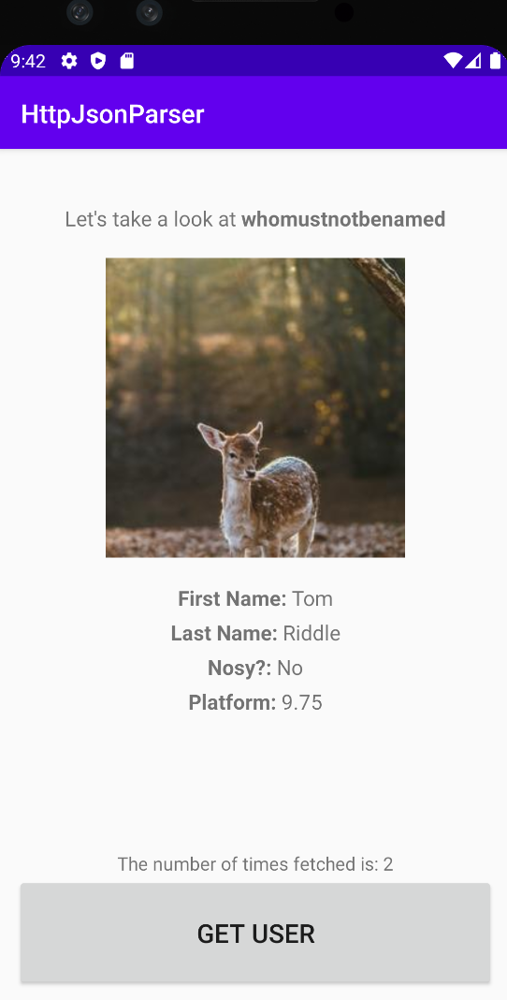

# HW4: HttpJsonParser by Ashmann Syngle

This app is able to fetch a JSON object from a url and display it after the user taps on 'Get User.' It also maintains a count of how many times the user taps on the button

## Screenshots

## Installation & Usage
N/A 